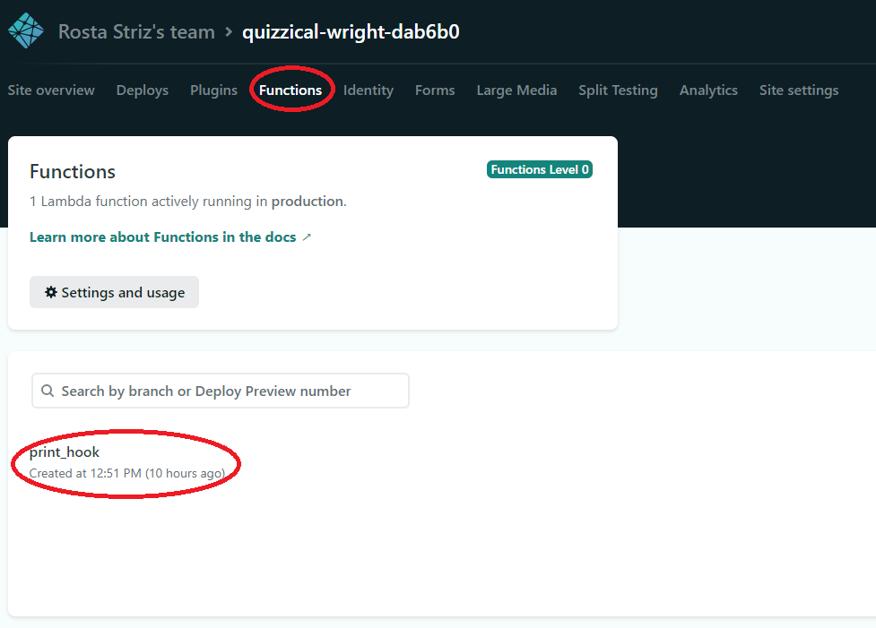
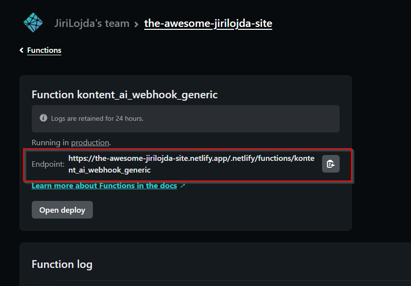
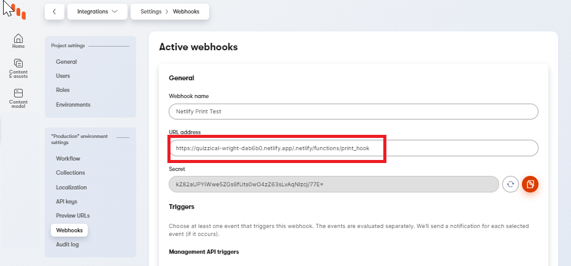
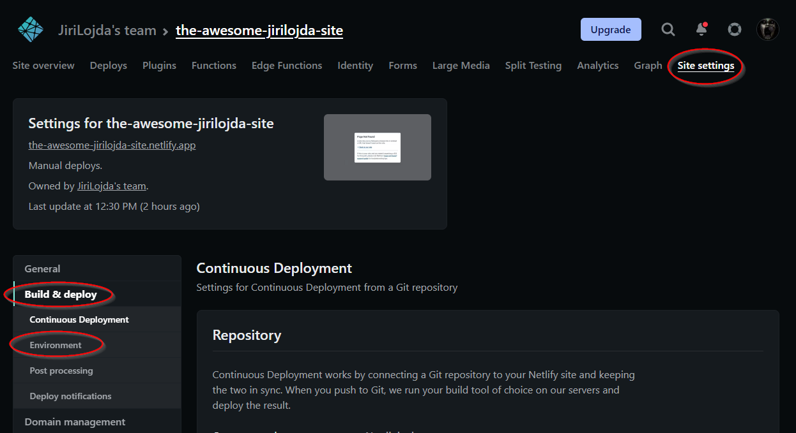
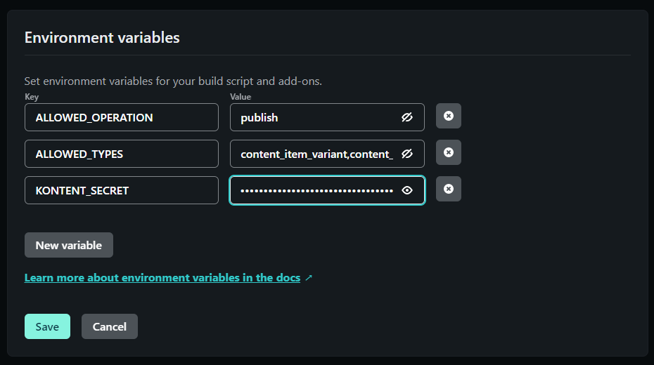

[![Gallery][gallery-shield]](https://kentico.github.io/kontent-custom-element-samples/gallery/)

![Last modified][last-commit]
[![Issues][issues-shield]][issues-url]
[![Contributors][contributors-shield]][contributors-url]
[![Forks][forks-shield]][forks-url]
[![MIT License][license-shield]][license-url]

[![Stack Overflow][stack-shield]](https://stackoverflow.com/tags/kentico-kontent)
[![GitHub Discussions][discussion-shield]](https://github.com/Kentico/Home/discussions)

<image src="docs/01-kk-logo-main.svg" alt="kontent logo" width="200" />
<image src="docs/netlify_logo.png" alt="netlify logo" width="300">

  <a href="#when-to-use">Use cases</a> •
  <a href="#setup">Setup</a> •
  <a href="#contributors">Contributors</a> •
  <a href="#license">License</a> •
  <a href="#additional-resources">Resources</a>

This repository contains a _template_ for a [Netlify function](https://docs.netlify.com/functions/overview/) that allows you to easily process any [webhook](https://docs.kontent.ai/tutorials/develop-apps/integrate/webhooks) coming from [Kentico Kontent](https://kontent.ai/).

## When to use
This is a **template** to show a simple way to process webhooks coming from Kontent. It's currently written to process [Delivery API Triggers](https://docs.kontent.ai/reference/webhooks-reference#a-delivery-api-triggers), but can be **easily extended/changed** to support any desired scenario.

In its current form, the template will let you:
- specify which webhooks you want to process (types + operations)
- automatically let's you access the latest version of affected content through Kontent's [Delivery API](https://docs.kontent.ai/reference/delivery-api)

The general **example use case** would be any type of content sychronization triggered by changes to the original content. Example scenarios might include _website search_, _synchronizing content for recommendations_, or _caching_, etc. 

> **⚠ WARNING: The Netlify functions are currently _stateless_, so there is no way to store/access any previous context within the function.**

## Setup

1. ### Quick Deploy
    Netlify has made this easy. If you click the deploy button below, it will guide you through the process of deploying it to Netlify and leave you with a copy of the repository in your account as well.

    

    Once your project is deployed, navigate to the **Functions** tab and click your deployed function. 

    

    To continue the setup, you'll need to **copy** the function's **Endpoint** URL, i.e. the URL the function is listening on. 

    
2. ### Create a new Webhook in Kentico Kontent
    The next step is [creating a new webhook in Kentico Kontent](https://docs.kontent.ai/tutorials/develop-apps/integrate/webhooks#a-create-a-webhook). 

    You'll insert your copied **netlify function endpoint url** into the **URL address** field, like on the image below. 

    

    After naming your webhook and setting up the URL, your webhook **Secret** is going to be generated. Copy the secret, set your desired triggers, and save the webhook. 

3. ### Configuring the Netlify Function
    In order to make the functions reusable and configurable, we are going to be leveraging [Netlify's environment variables](https://docs.netlify.com/configure-builds/environment-variables/).

    > **⚠ WARNING: Since the variables are being evaluated at build-time, you'll have to rebuild your site in order to propagate any change you make to any of your variables.**

    There is a [webhook validation mechanism](https://docs.kontent.ai/tutorials/develop-apps/integrate/webhooks#a-validate-received-notifications) implemented for Kontent's webhooks. 
    The **secret** we generated in the previous step while creating a new webhook is used to ensure integrity of the webhook's payload, i.e. it confirms the payload was not tampered with during its journey.

    You'll need to share this secret with your netlify function so that the integrity check can be performed. 

    The **environment variables** can be found under **Site settings** -> **Build & deploy** -> **Environment**.

    

    Here, you'll be able to create your variables. This example uses 
    
    - **ALLOWED_OPERATIONS** as a list of [operations](https://docs.kontent.ai/reference/webhooks-reference#a-types-and-operations) the function will accept (string, multiple values delimited by comma `,`)
    - **ALLOWED_TYPES** as a list of [event types](https://docs.kontent.ai/reference/webhooks-reference#a-types-and-operations) the function will accept (string. multiple values delimited by comma `,`)
    - **KONTENT_SECRET** as the generated webhook secret you obtained from the previous step 

    

    In the context of your function, the environment variables can be accessed through `process.env.YOUR_VARIABLE`.  

4. ### Redeploy your function
    As mentioned above, the function has to be _refreshed_ for the variable changes to take place. Navigate under **Deploys** and redeploy the site manually by clicking the **Trigger Deploy** button. 

    After your function has been redeployed (takes no time at all), it should be ready for receiving and filtering webhooks. You can observe the real-time **Function log** on the same screen you'd find your function's endpoint (_Functions_ -> _your function_). 

## Contributors
We have collected notes on how to contribute to this project in [CONTRIBUTING.md](CONTRIBUTING.md).

## License

[MIT](https://tldrlegal.com/license/mit-license)

## Additional Resources

- [Custom Element Gallery on github](https://kentico.github.io/kontent-custom-element-samples/gallery/)
- [Kentico Kontent's Integration documentation](https://docs.kontent.ai/tutorials/develop-apps/integrate/integrations-overview)

[last-commit]: https://img.shields.io/github/last-commit/Kentico/kontent-netlify-webhook-processor?style=for-the-badge
[contributors-shield]: https://img.shields.io/github/contributors/Kentico/kontent-netlify-webhook-processor.svg?style=for-the-badge
[contributors-url]: https://github.com/Kentico/kontent-netlify-webhook-processor/graphs/contributors
[forks-shield]: https://img.shields.io/github/forks/Kentico/kontent-netlify-webhook-processor.svg?style=for-the-badge
[forks-url]: https://github.com/Kentico/kontent-netlify-webhook-processor/network/members
[stars-shield]: https://img.shields.io/github/stars/Kentico/kontent-netlify-webhook-processor.svg?style=for-the-badge
[stars-url]: https://github.com/Kentico/kontent-netlify-webhook-processor/stargazers
[issues-shield]: https://img.shields.io/github/issues/Kentico/kontent-netlify-webhook-processor.svg?style=for-the-badge
[issues-url]: https://github.com/Kentico/kontent-netlify-webhook-processor/issues
[license-shield]: https://img.shields.io/github/license/Kentico/kontent-netlify-webhook-processor.svg?style=for-the-badge
[license-url]: https://github.com/Kentico/kontent-netlify-webhook-processor/blob/master/LICENSE
[core-shield]: https://img.shields.io/static/v1?label=&message=core%20integration&style=for-the-badge&color=FF5733
[gallery-shield]: https://img.shields.io/static/v1?label=&message=extension%20gallery&style=for-the-badge&color=51bce0
[stack-shield]: https://img.shields.io/badge/Stack%20Overflow-ASK%20NOW-FE7A16.svg?logo=stackoverflow&logoColor=white&style=for-the-badge
[discussion-shield]: https://img.shields.io/badge/GitHub-Discussions-FE7A16.svg?logo=github&style=for-the-badge
[product-demo]: docs/demo.gif?raw=true
